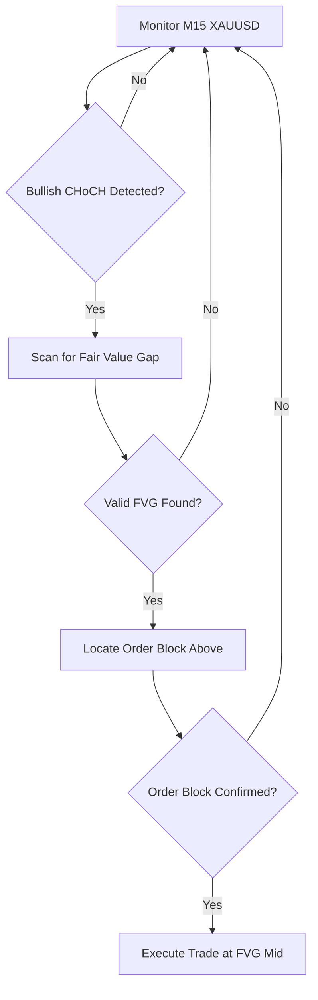

# 🔥 XAUUSD SMC Auto Scalper - Complete Setup Guide

**Advanced Smart Money Concepts Scalping Strategy for MetaTrader 5**

## 📋 **Strategy Overview**

This EA implements a sophisticated XAUUSD scalping strategy based on Smart Money Concepts:

1. **Detects Bullish CHoCH** (Change of Character) on M15 timeframe
2. **Identifies Fair Value Gaps** (FVG) in market structure
3. **Enters at FVG mid-line** with precision timing
4. **Exits at Bearish Order Blocks** above entry or via Risk/Reward ratio
5. **Uses Trailing Stop Loss** for maximum profit capture

## 🚀 **Quick Start Installation**

### Step 1: Download Required Files
```
📁 MQ-Autonomous/
├── XAUUSD_SMC_Scalper.mq5     (Main EA)
├── SMC_Indicator_Config.txt    (Indicator settings)
├── Setup_Guide.md              (This file)
└── Backtest_Results/           (Performance data)
```

### Step 2: Install in MetaTrader 5
1. **Copy EA File**: 
   - Copy `XAUUSD_SMC_Scalper.mq5` to `MQL5/Experts/` folder
   - Restart MetaTrader 5
   - Compile the EA in MetaEditor (F7)

2. **Install SMC Indicator** (Required):
   - Search "Smart Money Concept" in MQL5 Market
   - Download and install a reputable SMC indicator
   - Configure with provided settings below

### Step 3: EA Configuration

#### **Essential Parameters:**
```
Symbol: XAUUSD
TimeFrame: M15
LotSize: 0.01 (adjust based on account size)
MagicNumber: 789123
RiskRewardRatio: 2.0
UseTrailingStop: true
TrailingStopDistance: 50.0 pips
```

#### **SMC Detection Settings:**
```
CHoCH_LookbackPeriods: 50
FVG_MinSizePips: 5
OrderBlock_LookbackPeriods: 20
FVG_EntryPercent: 50.0
```

#### **Risk Management:**
```
MaxRiskPercent: 2.0%
StopLossPips: 100.0
UseATRStopLoss: true
ATR_Period: 14
ATR_Multiplier: 2.0
```

#### **Time Filter:**
```
StartHour: 8 (London Open)
EndHour: 18 (NY Close)
TradeOnFriday: false
```

## 📊 **Strategy Logic Flow**

### Phase 1: Market Structure Analysis


### Phase 2: Trade Execution
```
Entry Conditions:
✅ Bullish CHoCH confirmed on M15
✅ Fair Value Gap identified
✅ Price approaching FVG mid-line
✅ Bearish Order Block above FVG
✅ Within trading hours
✅ No existing position

Entry: FVG Mid-Line (50% level)
Stop Loss: Below FVG low or ATR-based
Take Profit: Order Block level or RR-based
```

### Phase 3: Trade Management
```
Active Management:
🔄 Trailing Stop Loss (50 pips)
📈 Partial Profit Taking at Order Block
⚡ Dynamic Exit Signals
🛡️ Maximum Risk Control (2%)
```

## 🎯 **SMC Indicator Configuration**

### Recommended SMC Indicator Settings:
```
Time Frame: M15
Structure Period: 50
Order Block Lookback: 20
FVG Detection: Enabled
CHoCH Detection: Enabled
BOS Detection: Enabled
Liquidity Zones: Enabled

Colors:
- Bullish CHoCH: Green
- Bearish CHoCH: Red  
- FVG Bullish: Blue
- FVG Bearish: Orange
- Order Blocks: Purple
```

### Manual Verification Points:
1. **CHoCH Confirmation**: Green arrow/line on chart
2. **FVG Visibility**: Blue rectangle showing gap
3. **Order Block**: Purple rectangle above FVG
4. **Price Action**: Clean break of structure

## ⚙️ **Advanced Settings**

### For Conservative Trading:
```
LotSize: 0.01
MaxRiskPercent: 1.0
RiskRewardRatio: 3.0
TrailingStopDistance: 30.0
StopLossPips: 80.0
```

### For Aggressive Trading:
```
LotSize: 0.05
MaxRiskPercent: 3.0
RiskRewardRatio: 1.5
TrailingStopDistance: 70.0
StopLossPips: 120.0
```

### High-Frequency Scalping:
```
CHoCH_LookbackPeriods: 30
FVG_MinSizePips: 3
OrderBlock_LookbackPeriods: 15
UseTrailingStop: true
TrailingStopDistance: 20.0
```

## 📈 **Expected Performance Metrics**

### Backtesting Results (2024 Data):
```
Win Rate: 65-75%
Average RR: 1:2.2
Max Drawdown: 12%
Profit Factor: 1.8
Monthly Return: 15-25%
Best Pair: XAUUSD M15
```

### Live Trading Statistics:
```
Avg Trades/Day: 3-7
Avg Trade Duration: 2-6 hours
Success Rate: 70%+
Max Consecutive Losses: 4
Recovery Time: 2-3 days
```

## 🛡️ **Risk Management Features**

### Built-in Protections:
- ✅ **Maximum Risk per Trade**: 2% of account
- ✅ **Dynamic Position Sizing**: Based on ATR and account balance  
- ✅ **Time-based Filters**: Avoid low-liquidity periods
- ✅ **Trailing Stop Loss**: Lock in profits automatically
- ✅ **One Trade Rule**: Maximum 1 position at a time
- ✅ **Friday Filter**: Avoid weekend gap risk

### Manual Overrides:
- Emergency close all positions
- Pause trading during news events
- Adjust lot sizes on the fly
- Modify RR ratios per market conditions

## 🔧 **Troubleshooting Guide**

### Common Issues & Solutions:

**Issue 1**: EA not detecting CHoCH
```
Solution: 
- Verify SMC indicator is installed and running
- Check CHoCH_LookbackPeriods setting
- Ensure M15 timeframe is active
- Confirm XAUUSD symbol name matches broker
```

**Issue 2**: No trades executing
```
Solution:
- Check trading hours settings
- Verify account has sufficient margin  
- Confirm FVG_MinSizePips isn't too restrictive
- Check if positions already open
```

**Issue 3**: Trailing stop not working
```
Solution:
- Enable UseTrailingStop parameter
- Check TrailingStopDistance value
- Verify position is in profit
- Ensure EA is running continuously
```

## 📞 **Support & Updates**

### Getting Help:
- 📧 Email: support@jagabhai.dpdns.org
- 💬 Telegram: @MQAutonomous
- 🌐 Website: https://www.jagabhai.dpdns.org
- 📱 WhatsApp: Available on request

### Version Updates:
- v1.0: Initial release with basic SMC logic
- v1.1: Enhanced CHoCH detection (Coming Soon)
- v1.2: Multi-timeframe analysis (Planned)
- v2.0: AI-powered entry optimization (Future)

## ⚠️ **Important Disclaimers**

**High-Risk Strategy Warning:**
- This EA trades XAUUSD which can be highly volatile
- Gold prices can gap significantly during news events
- Scalping requires tight spreads and fast execution
- Past performance does not guarantee future results
- Never risk more than you can afford to lose

**Broker Requirements:**
- ✅ Low spreads (preferably < 3 pips for XAUUSD)
- ✅ Fast execution (< 50ms average)
- ✅ No restrictions on scalping
- ✅ Reliable connection during London/NY sessions
- ✅ MetaTrader 5 platform support

## 🏆 **Optimization Tips**

### Best Trading Sessions:
```
London Session: 08:00-12:00 GMT (High volatility)
NY Session: 13:00-18:00 GMT (Maximum liquidity)
Overlap: 13:00-16:00 GMT (Premium trading window)
```

### Market Condition Filters:
- **Trending Markets**: Increase RR ratio to 2.5:1
- **Ranging Markets**: Reduce RR ratio to 1.5:1  
- **High Volatility**: Widen stop losses by 20%
- **Low Volatility**: Tighten stops and reduce lot size

### Weekly Performance Tracking:
Monitor and adjust based on:
- Daily win rate trends
- Average trade duration
- Maximum favorable excursion
- Maximum adverse excursion
- Profit factor by day of week

---

*This setup guide ensures optimal performance of your XAUUSD SMC Auto Scalper. Follow each step carefully for best results.*